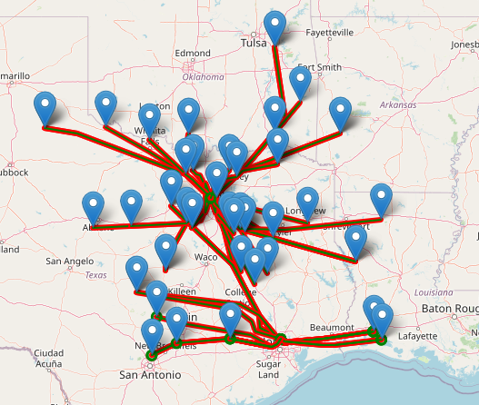

# Route Availability Prediction
Project created during the AIGames '22 hackathon. Task definition:

> In this challenge, the goal is to predict route availability at three different airports -
Seattle-Tacoma (KSEA), Dallas Fort Worth (KDFW) & Houston George Bush (KIAH). You will be
given observational weather data and your task will be to predict the status of a route in 1 hour
from weather data’s timestamp.

  

